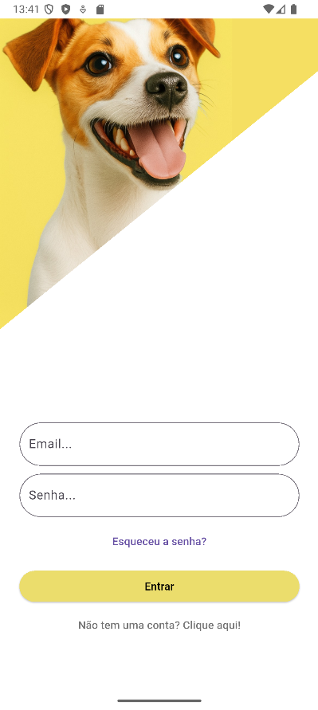
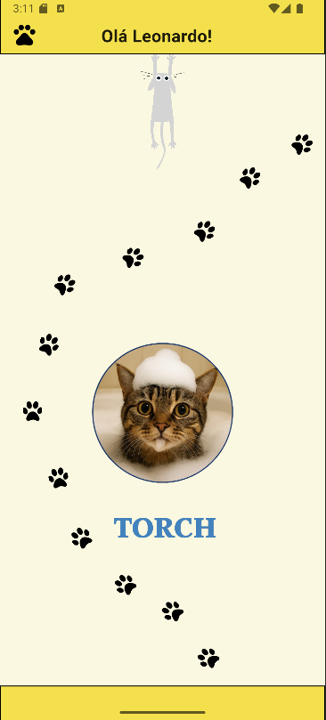
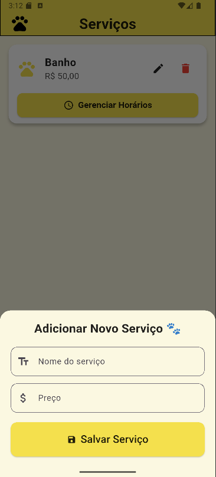
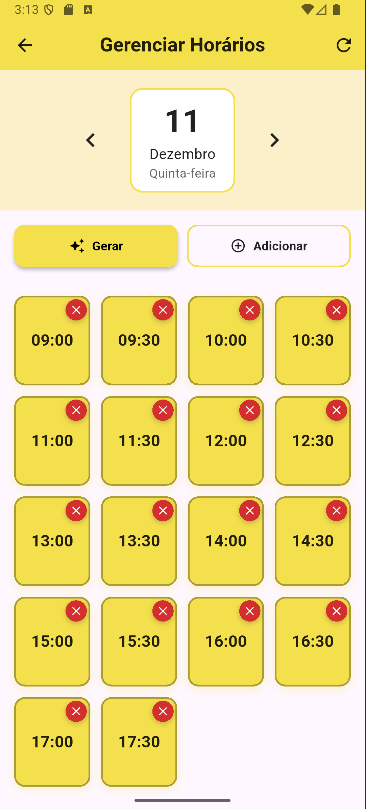
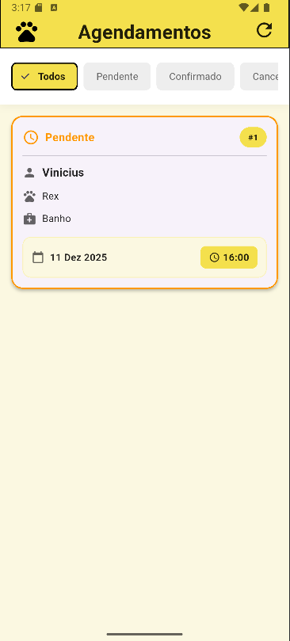
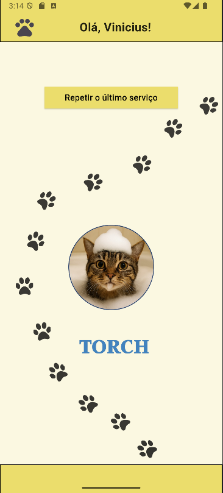
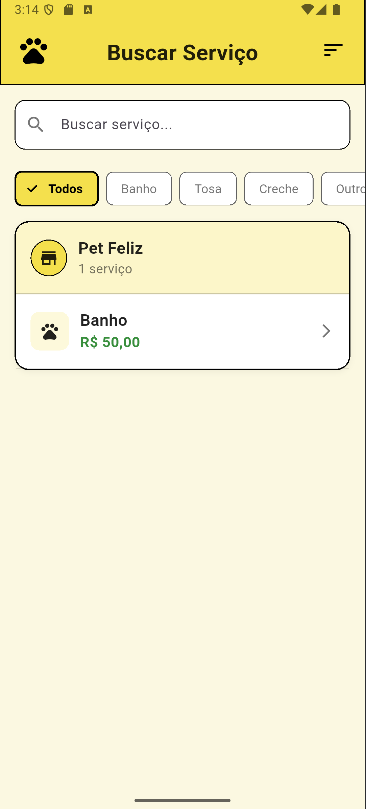
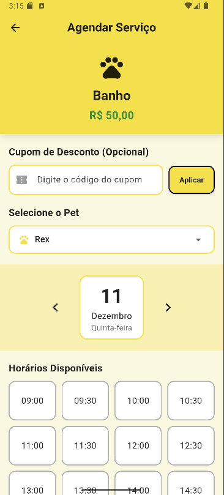
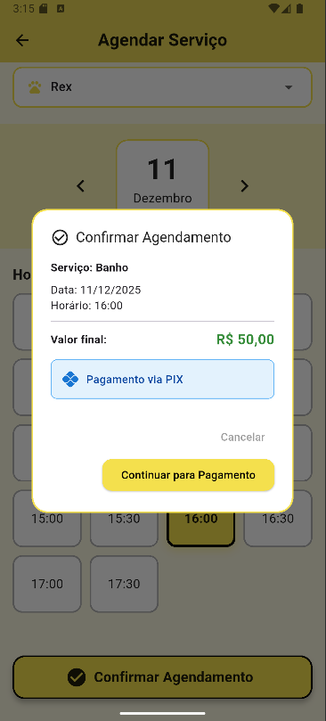

---

# Frontend 🐾

Aplicativo mobile desenvolvido em Flutter para o projeto Torch, focado no agendamento rápido e intuitivo de serviços em Pet Shops.<br>
O Backend está disponível [aqui.](https://github.com/VStorch/TorchAppBackend)<br>
Já a página de redirecionamento para a redefinição de senha está [aqui](https://github.com/VStorch/PaginaRedirecionamento)

---

### Índice

- [Descrição](#descrição)
- [Funcionalidades](#funcionalidades)
- [Tipos de Usuário](#tipos-de-usuário)
- [Tecnologias e Dependências](#tecnologias-e-dependências)
- [Arquitetura](#arquitetura)
- [Como rodar o projeto](#como-rodar-o-projeto)
- [Estrutura de pastas](#estrutura-de-pastas)
- [Capturas de tela](#capturas-de-tela)
- [Fluxo de navegação](#fluxo-de-navegação)
- [Integração com o backend](#integração-com-o-backend)
- [Desenvolvedores](#desenvolvedores)
- [Status do projeto](#status-do-projeto)

---

### Descrição

O Torch é um aplicativo móvel desenvolvido para facilitar o agendamento de horários em Pet Shops. Com uma interface intuitiva, o app permite que os usuários agendem rapidamente serviços para seus animais de estimação, enquanto os Pet Shops podem gerenciar seus horários de forma eficiente. O objetivo é proporcionar agilidade tanto para os clientes quanto para os fornecedores de serviços.

---

### Funcionalidades

#### Tipos de Usuário

O Torch possui dois perfis de uso, cada um com funcionalidades específicas:

1. Cliente
    - Cadastra seus próprios pets
    - Visualiza serviços e ofertas disponibilizados pelos Pet Shops
    - Verifica horários livres conforme o serviço escolhido
    - Faz agendamentos
    - Gerencia agendamentos futuros
    - Atualiza seus dados

2. Dono de Pet Shop
    - Possui um Pet Shop associado à sua conta
    - Cadastra e edita serviços oferecidos
    - Gera slots de horário para dias específicos, vinculados aos serviços
    - Acompanha agendamentos realizados por clientes
    - Atualiza informações do Pet Shop
    - Gerencia perfil

---

### Tecnologias e Dependências

**Base**
- Flutter 3.32.3
- Dart 3.8.1
- Material Design 3
- Flutter Localizations

**Comunicação com API**
- Dio 5.7.0
- http 1.5.0

**Armazenamento Local**
- shared_preferences 2.2.2

**Imagens e Mídias**
- image_picker 1.0.4<br>
    Para capturar fotos da câmera ou selecionar da galeria

**Interface e animações**
- lottie 2.2.0<br>
    Exibição de animações em JSON

**Mapas**
- flutter_map 5.1.0

**Internacionalização**
- intl 0.20.2

**Assets**
- Animações diversificadas
- Imagens diversas
- Pastas organizadas em:<br>
    `lib/assets/images/`<br>
    `lib/assets/images_profile/`
    
**Fontes customizadas**
- Inknut Antiqua (Regular/Semibold/Bold/Black)
- InclusiveSans

---

### Arquitetura

---

### Como rodar o projeto

1. Clonar o repositório

    ```bash
    git clone https://github.com/VStorch/TorchApp.git
    cd TorchApp
    ```

2. Instalar dependências

    ```bash
    flutter pub get
    ```

3. Rodar o app

    ```bash
    flutter run
    ```

    Se houverem problemas com dependências ou configurações, execute os seguintes comandos:

    ```bash
    flutter clean
    flutter pub get
    flutter run
    ```
    
---

### Estrutura de pastas

---

### Capturas de tela

Segue algumas telas do sistema

<div style="display: flex; gap: 20px; flex-wrap: wrap; justify-content: center;">
  <figure style="display: block; text-align: center;">
    
    <figcaption>Tela de carregamento</figcaption>
  </figure>

  <figure style="display: block; text-align: center;">
    
    <figcaption>Tela de login</figcaption>
  </figure>
</div>

#### Telas do Pet Shop

<div style="display: flex; gap: 20px; flex-wrap: wrap; justify-content: center;">
  <figure style="display: block; text-align: center;">
    
    <figcaption>Tela inicial do Pet Shop</figcaption>
  </figure>

  <figure style="display: block; text-align: center;">
    
    <figcaption>Tela de serviços</figcaption>
  </figure>
</div>

<div style="display: flex; gap: 20px; flex-wrap: wrap; justify-content: center;">
  <figure style="display: block; text-align: center;">
    
    <figcaption>Tela de criação de slots de horário</figcaption>
  </figure>

  <figure style="display: block; text-align: center;">
    
    <figcaption>Tela de agendamentos</figcaption>
  </figure>
</div>

#### Telas do Cliente

<div style="display: flex; gap: 20px; flex-wrap: wrap; justify-content: center;">
  <figure style="display: block; text-align: center;">
    
    <figcaption>Tela inicial do Cliente</figcaption>
  </figure>

  <figure style="display: block; text-align: center;">
    
    <figcaption>Tela que lista os serviços</figcaption>
  </figure>
</div>

<div style="display: flex; gap: 20px; flex-wrap: wrap; justify-content: center;">
  <figure style="display: block; text-align: center;">
    
    <figcaption>Tela de agendamento</figcaption>
  </figure>

  <figure style="display: block; text-align: center;">
    
    <figcaption>Confirmação do agendamento</figcaption>
  </figure>
</div>

---

### Fluxo de navegação

---

### Integração com o backend

---

### Desenvolvedores

- [João Pedro Pitz](https://github.com/joaopedropitzz)
- [Leonardo Cortelim dos Santos](https://github.com/LeonardoCortelim)
- [Vinícius Storch](https://github.com/VStorch)

---

### Status do projeto

Em desenvolvimento.